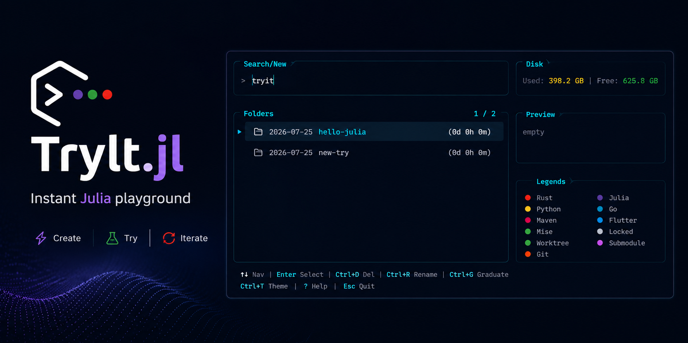

# TryIt.jl

[](https://github.com/s-celles/TryIt.jl/actions/workflows/CI.yml)
[](https://codecov.io/gh/s-celles/TryIt.jl)
[](https://s-celles.github.io/TryIt.jl/stable)
[](https://s-celles.github.io/TryIt.jl/dev)
[](https://github.com/JuliaTesting/Aqua.jl)



A Julia ephemeral-workspace manager for developers — a `tryit` command
that spins up, filters, and graduates dated scratch directories from
your terminal.

## Inspiration

TryIt.jl is a functional mirror of two prior tools, with one high-level
[ManyUI](https://github.com/s-celles/ManyUI.jl) application projected to a
local TUI, native browser controls, or a browser-hosted terminal:

- [`try`](https://github.com/tobi/try) by Tobi Lütke — the original,
  distributed as the [`try-cli` gem](https://rubygems.org/gems/try-cli).
- [`try-cli`](https://github.com/tobi/try-cli) — a C implementation of
  the same tool. Despite sharing the gem's name, it is a separate
  codebase.
- [`try-rs`](https://github.com/tassiovirginio/try-rs) — a Rust port
  and re-imagination with a modern TUI.

TryIt.jl follows `try-rs` for the default tries root
(`$HOME/work/tries`); `try-cli` uses `$HOME/src/tries`. `TRY_PATH`
overrides it in either case.

All three share the same model: date-prefixed directories under a
tries root, an interactive fuzzy selector biased toward recently
touched entries, and a shell function that `eval`s a `cd` emitted on
stdout.

## Status

Pre-stable (0.x). The exported entry points are the CLI-oriented `main` and
the embeddable `launch_selector`.

## Install

### As a Julia package (development)

```sh
julia --startup-file=no --project=@TryIt -e 'using Pkg; Pkg.develop(path="."); Pkg.precompile()'
```

Then wire the shell function into your `.bashrc` / `.zshrc`:

```sh
eval "$(julia --startup-file=no --project=@TryIt -e 'using TryIt; TryIt.main(["init"])')"
```

### As a standalone app

Build a self-contained `tryit` executable that carries its own Julia
runtime — no `julia` required on the target machine, and no
interpreter startup cost per invocation:

```sh
julia --startup-file=no --project=build build/build.jl
```

The bundle lands in `build/tryit-app/`, with the executable at
`build/tryit-app/bin/tryit`. Wire it up the same way:

```sh
eval "$(/path/to/build/tryit-app/bin/tryit init)"
```

`tryit init` detects which form it is running as and emits the
matching shell function, so the same command works for both.

## Configuration

| Variable         | Meaning                                           |
| ---------------- | ------------------------------------------------- |
| `TRY_PATH`     | Tries root (default `$HOME/work/tries`)          |
| `TRY_PROJECTS` | Graduation target (default `dirname($TRY_PATH)`) |
| `TRY_EDITOR`   | Editor launched on a try                          |
| `TRY_TEMPLATE` | Directory copied into each new try                |
| `TRY_THEME`    | Startup theme, any of 24 (`Ctrl+T` picks live)   |
| `TRY_BACKGROUND` | Animated background: `fog` (default), `aurora`, `plasma`, `rain`, `pulse`, `mesh`, `dotwave`, `phylo`, `clado`, `off` |
| `TRY_BACKGROUND_PRESET` | Variant index for the glyph backgrounds |
| `TRY_ANIMATION`| Alias for `TRY_BACKGROUND`                        |
| `TRY_CONFIG`   | Config file path (default `~/.config/tryit/config.toml`) |
| `TRY_FPS`      | Frame rate for the selector (default `60`)        |
| `TRY_SHOW_FPS` | Show an on-screen frames-per-second readout       |
| `TRY_FRONTEND` | Selector target: `tui` (default), `webnative`, `webtui`, or legacy `tachikoma` |
| `TRY_WEB_PORT` | Port for WebNative/WebTUI (default `8000`)        |
| `TRY_TIMEZONE` | Date zone: `local` (default) or `utc`             |
| `NO_COLOR`     | Disables colored output                           |

The tries root, theme and animation can also live in
`~/.config/tryit/config.toml`, with the environment taking precedence
over the file:

```toml
tries_path = "~/src/tries"   # `~` is expanded
theme = "dracula"
animation = "plasma"
```

The same selector can be launched directly from Julia:

```julia
using TryIt
launch_selector(frontend=:webnative, port=8080)
```

`tries_path` matters most when sharing a root with `try-rs`, whose own
config uses the same key and the same `~` spelling.

## Development

After changing any dependency, re-resolve every environment that pins
TryIt — the package, `docs`, and the `@TryIt` shared environment the
shell function runs against:

```sh
./bin/resolve-envs.sh
```

Skipping it leaves `tryit` failing to precompile while the test suite
still passes. See the [development
guide](https://s-celles.github.io/TryIt.jl/dev/development/).

## Documentation

Full walkthrough, key bindings, and API reference:
[stable](https://s-celles.github.io/TryIt.jl/stable) ·
[dev](https://s-celles.github.io/TryIt.jl/dev).

## License

MIT — see [`LICENSE`](LICENSE).
